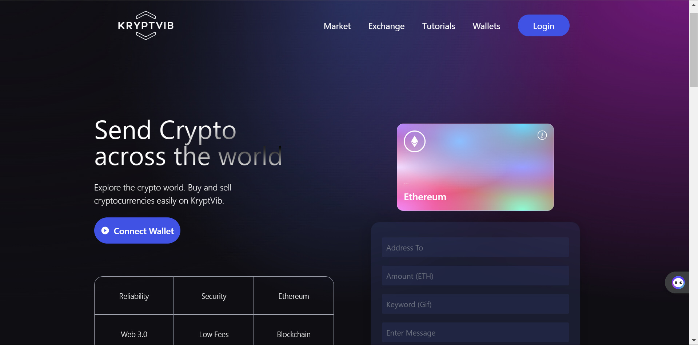

## KryptVib: Secure Crypto Exchange Web Application

## Introduction
Welcome to KryptVib, a state-of-the-art crypto exchange platform designed with a focus on robust security and seamless trading experience. KryptVib features an advanced 7-layer integrated firewall, ensuring top-tier protection against potential threats while allowing users to trade cryptocurrencies with peace of mind.

Key Features:

Multi-Layered Security: The 7-layer firewall provides unparalleled security, safeguarding sensitive data and transactions.
User-Friendly Interface: Intuitive design for both beginners and experienced traders.
Efficient Trading: Real-time updates and smooth transaction processing.
Dive in and explore the code behind this highly secure crypto trading platform!

[Visit KryptVib](https://66cdf9bb0a0f553a71e2eed0--preeminent-scone-45bffb.netlify.app/)

